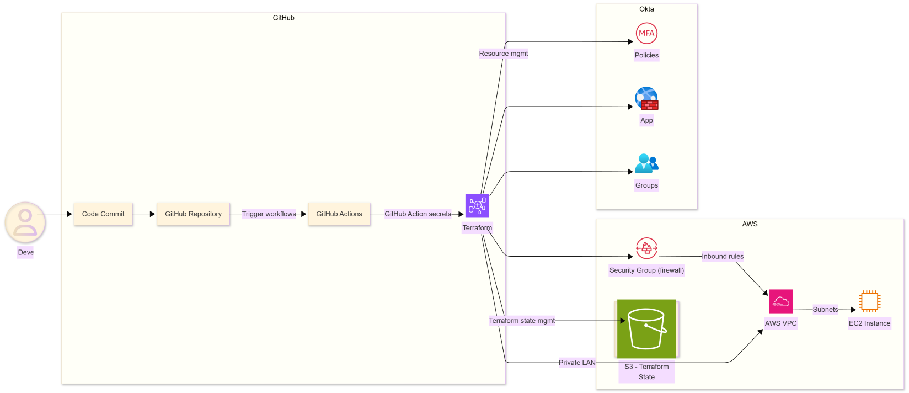

# Core Systems IaC: Okta + AWS EC2 CI/CD Pipeline

This repository contains an infrastructure-as-code and CI/CD design for managing:

- An **Okta instance** (groups, apps, and policies), and  
- An **AWS EC2 “server set”** (networking + instances)

using a **GitOps-style** workflow. All changes are made via pull requests, validated in CI, and then applied to environments through an automated pipeline.

---

## 1. Goals

The design aims to:

1. Treat both **identity** (Okta) and **compute** (AWS EC2) as **code**.
2. Use **Git as the source of truth** for configuration.
3. Provide a **safe, auditable change process**:
   - Plan → review → apply  
   - Separate dev and prod(TODO) environments
   - Stricter controls for Okta (higher blast radius)
4. **small but realistic** solution for a corporate infrastructure context.

---

## 2. High-Level Overview

At a high level:

- Okta and AWS resources are defined in **Terraform**.
- When a change is opened as a **pull request**:
  - CI runs `terraform fmt` and `terraform validate`.
  - CI runs **plans** for:
    - Okta (dev tenant)
    - AWS (dev environment)
- Once the PR is reviewed and merged into `main`:
  - CI automatically **applies** changes to **dev** (Okta + AWS).
- Ideally promotion to **production** is done via **manual CI jobs**:
  - Separate jobs for Okta prod and AWS prod.
  - Okta prod requires manual intent because identity changes could be more sensitive.

---

## 3. CI/CD topology




**How the AWS instance and network are created**

1. VPC: private network boundary

I start by creating a dedicated VPC:

This VPC is the isolated network for all resources in this stack; nothing lives in the default VPC. It gives a clean boundary for routing, security groups, and future expansion.

2. Public and private subnets

Inside the VPC I define two subnets:

PublicSubnet: 10.0.1.0/24

PrivateSubnet: 10.0.2.0/24

The public subnet is where I place the internet-facing EC2 instance. The private subnet is reserved for internal services (e.g., databases or app services) if this were extended later.

3. Internet gateway and route table

To allow instances in the public subnet to reach the internet, I:

Create an Internet Gateway attached to the VPC.

Create a route table for the VPC with:

A default route 0.0.0.0/0 that points to the internet gateway.

Associate that route table with the PublicSubnet.

4. Security group (firewall) for the web instance

Next I define a security group specifically for the EC2 instance:

Attached to the same VPC.

Ingress rules:

HTTP (port 80) from anywhere.

HTTPS (port 443) from anywhere.

SSH (port 22) from anywhere (acceptable for a demo, but I’d tighten this in a real environment).

Egress rule:

All outbound traffic allowed.

This security group acts as the instance’s firewall. For a real production setup, I’d typically restrict SSH to a bastion host, specific IP ranges, or use SSM Session Manager instead of 0.0.0.0/0.

5. EC2 instance (server):

With the network and security group in place, I define the EC2 instance itself:

AMI: Amazon Linux 2

Instance type: t3.micro (small, cost-effective demo size).

Terraform builds this instance inside the VPC with the correct subnet and security group dependencies, so everything comes up in a known, repeatable way. In a real environment, further configuration (hardening, agents, application code) could be layered on using user-data, Ansible, or SSM.

6. S3 bucket for supporting infra

Finally, I create an S3 bucket to store the Terraform remote state file. It also shows how I'd provision shared infra like state buckets, logs, or config storage.

**How the Okta configuration is created**

The goal here is to define:

A high-security cohort of users

A baseline “everyone” cohort

App-specific authentication rules with different MFA/session behavior per cohort

An OAuth web app that’s bound to those rules

All of this is managed through Terraform and the same CI/CD pipeline.

1. Configure the Okta provider

Firstly, configure the Terraform Okta provider with variables for the org and credentials:

org_name – the Okta org (e.g., mycompany).

api_token – API token (injected via Terraform variables / CI secrets).

base_url – Okta base domain (e.g., okta.com, okta-emea.com).

2. Reference the built-in “Everyone” group

Next, I look up the built-in Everyone group using a data source:

Terraform doesn’t create this group; it already exists in most Okta orgs.

I use its name (provided via var.everyone_group_name) to get its ID.

This group becomes the baseline cohort for app access and MFA rules. It lets me say: “Unless you’re in a special high-risk group, you follow the general policy for everyone.”

3. Create a high-security group

I then create a dedicated restricted/high-security group, for example:

restricted_users

Description: users who require stricter MFA for a particular app.

This group is used to represent elevated-risk users, such as admins or people accessing sensitive internal systems. Anyone added to this group automatically gets a tighter security posture for the app we define later.

4. Define an app-specific sign-on policy

Instead of relying only on global org policies, I create an app-level sign-on policy:

Marked as catch_all = true so it serves as the default policy for that app.

This policy is scoped to one OAuth app, which gives more control: I can tune MFA and session settings for this specific application without impacting every other app in the org.

5. Add policy rules for different cohorts

Within that app-specific policy, I define two rules with different priorities:

Rule 1 – Restricted Users (priority 1)

Target: the restricted_users group only.

Access: ALLOW with factor_mode = "2FA" (MFA always required).

Re-authentication settings:

Shorter re-auth interval (e.g., every 2 hours).

Shorter inactivity timeout (e.g., 30 minutes).

Net effect: stricter MFA and shorter sessions for high-risk users.

Rule 2 – Everyone (priority 2)

Target: the built-in Everyone group.

Access: also ALLOW with factor_mode = "2FA" (MFA still required).

Re-authentication settings:

Longer re-auth interval (e.g., every 12 hours).

Longer inactivity timeout (e.g., 1 hour).

Net effect: baseline MFA for all users, but not as aggressively strict as the restricted cohort.

Because the restricted rule has higher priority, Okta evaluates it first:

If you’re in restricted_users, you get the tighter rule.

If not, you fall back to the Everyone rule.

6. Create an OAuth web application

Finally, I define an OAuth 2.0 web app in Okta:

The important part is:

authentication_policy = okta_app_signon_policy.app_auth_policy.id

This explicitly binds the OAuth app to the app-specific sign-on policy created earlier. In practice, that means:

When users access this app, Okta evaluates:

Rule 1 for restricted users (strict MFA/short sessions).

Rule 2 for everyone else (baseline MFA/longer sessions).

I also set sensible defaults for:

Token endpoint authentication (client_secret_basic).

Issuer mode (ORG_URL).

Username template (using the source login).

In a real environment, this pattern scales out:

More apps can reuse the same module pattern.

More cohorts/groups can be added as needed.


**Prerequisites**
---
Terraform 1.14+ (tested with 1.14.x)
AWS Access key ID with permissions to EC2FullAccess/S3FullAccess
Okta API token with permissions to manage apps/policies

**Commands for Testing**
```text


# Clone or copy these files into a folder

# cd to correct directory (okta or aws)

# For Okta integration
cp terraform.tfvars.example terraform.tfvars
# Edit terraform.tfvars with your values (or set TF_VAR_* envs)

# Validate the reorganized structure
terraform validate

# Format all files consistently
terraform fmt -recursive

# Plan to ensure no changes
terraform plan

# Apply if everything looks good
terraform apply


